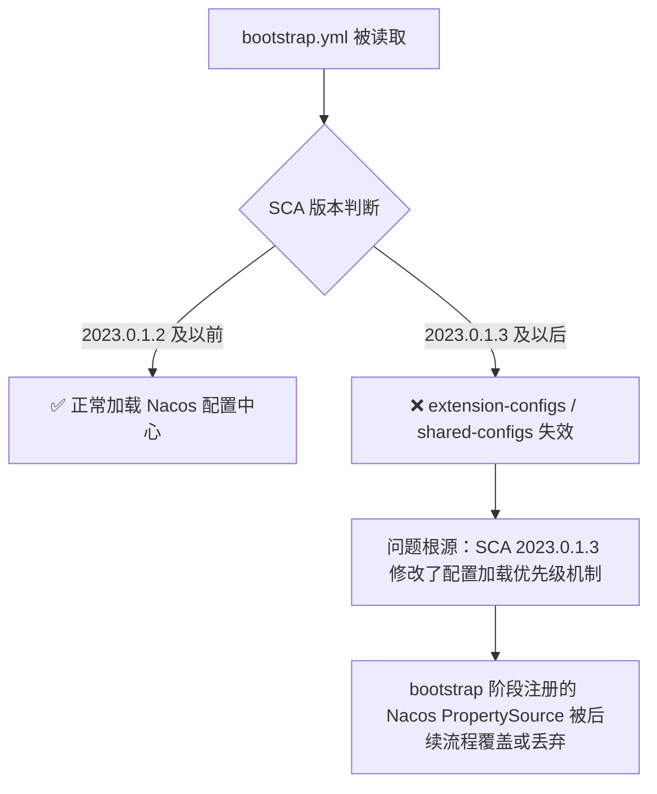
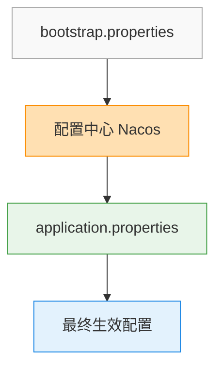

+++
date = '2026-06-24T22:40:26+08:00'
draft = false
title = 'SCA 2023.X — Nacos Bootstrap 配置失效问题排查与解决方案'
categories = ["编程"]
tags = ["后端疑难杂症解答"]
[cover]
  image = "https://devtool.tech/api/placeholder/600/199?text=Nacos Bootstrap 配置失效问题排查与解决方案💻&color=black&fontSize=20&fontFamily=%E5%BE%AE%E8%BD%AF%E9%9B%85%E9%BB%91"
+++

> **Issue 来源**：[spring-cloud-alibaba#3931](https://github.com/alibaba/spring-cloud-alibaba/issues/3931)  
> **影响版本**：`spring-cloud-alibaba 2023.0.1.3+`

---

## 一、问题描述

在 Spring Cloud Alibaba 2023.X 版本中，将 Nacos 配置（包括 `extension-configs`、`shared-configs` 等）放在 `bootstrap.yml` / `bootstrap.properties` 中，**配置中心的内容无法正常加载**，但日志显示 `bootstrap` 文件本身已被读取。

将相同配置移到 `application.yml` 后，一切恢复正常。

---

## 二、根本原因



**简单来说：**  
SCA `2023.0.1.3` 做了一次**不向后兼容的内部变更**，导致 `bootstrap.yml` 中的 Nacos 扩展配置在加载链路中被"丢掉"，而 `application.yml` 中的配置走的是新路径，不受影响。

---

## 三、解决方案

### ✅ 方案一（推荐）：迁移到 `application.yml`（官方推荐方式）

SCA 2023.X 已全面转向 `spring.config.import` 机制，**不再以 bootstrap 为主要入口**。

```yaml
# application.yml
spring:
  application:
    name: your-service
  cloud:
    nacos:
      config:
        server-addr: 127.0.0.1:8848
        namespace: your-namespace
        group: DEFAULT_GROUP
        file-extension: yaml
        extension-configs:
          - data-id: common.yaml
            group: DEFAULT_GROUP
            refresh: true
        shared-configs:
          - data-id: shared.yaml
            group: DEFAULT_GROUP
            refresh: true
  config:
    import:
      - nacos:your-service.yaml
```

---

### ✅ 方案二：版本回退（临时方案）

如果项目暂时无法迁移配置文件，可回退到 `2023.0.1.2`：

```xml
<dependency>
    <groupId>com.alibaba.cloud</groupId>
    <artifactId>spring-cloud-alibaba-dependencies</artifactId>
    <version>2023.0.1.2</version>
    <type>pom</type>
    <scope>import</scope>
</dependency>
```

> ⚠️ 此方案仅作过渡，不建议长期使用旧版本。

---

### ⚠️ 无效方案（已验证）

加入 `spring-cloud-starter-bootstrap` 依赖**不能解决**此问题：

```xml
<!-- ❌ 加了也没用 -->
<dependency>
    <groupId>org.springframework.cloud</groupId>
    <artifactId>spring-cloud-starter-bootstrap</artifactId>
</dependency>
```

原因：`bootstrap.yml` 本身 **已经被读取**（日志可见），问题出在 Nacos 扩展配置的后续处理阶段，而非 bootstrap 上下文未启动。

---

## 四、配置加载优先级（2023.X 新机制）



> 注意：在 2023.X 的新链路下，优先级从低到高为：  
> `bootstrap` → `Nacos 配置中心` → `application`  
> 即 **Nacos 配置中心的值可以覆盖 bootstrap，但会被 application 中的同名配置覆盖**。  
> 这与旧版本行为不同，迁移时需特别注意。

---

## 五、总结

| 项目         | 内容                                                                  |
| ------------ | --------------------------------------------------------------------- |
| **影响版本** | SCA `2023.0.1.3` 及以上                                               |
| **现象**     | `bootstrap.yml` 中 Nacos 配置被读取但不生效                           |
| **根因**     | SCA 小版本变更了配置加载机制，bootstrap 路径下的 Nacos 扩展配置被丢弃 |
| **推荐解法** | 全部迁移至 `application.yml` + `spring.config.import`                 |
| **临时解法** | 回退到 `2023.0.1.2`                                                   |
| **无效操作** | 添加 `spring-cloud-starter-bootstrap` 依赖                            |

