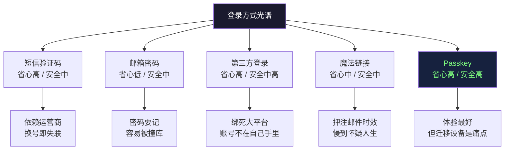
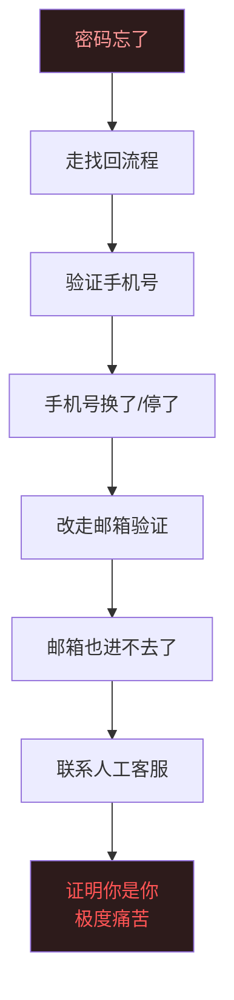
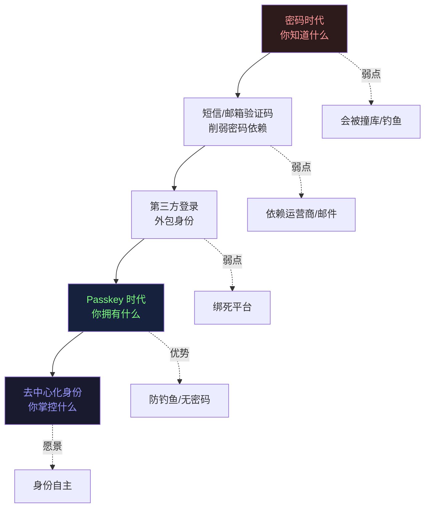
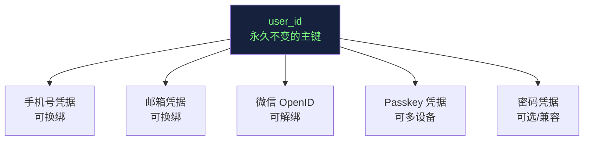

+++
date = '2026-06-26T15:56:40+08:00'
draft = true
title = '说一说登录这件麻烦事'
categories = ["编程"]
tags = [""]
description = "从手机验证码到 Passkey，聊聊登录背后那些没人愿意细想的麻烦，以及一套可落地的最佳实践。"
[cover]
  image = "https://devtool.tech/api/placeholder/600/199?text=🤯登录这件麻烦事🫠&color=black&fontSize=30&fontFamily=%E5%BE%AE%E8%BD%AF%E9%9B%85%E9%BB%91"
+++

每个写过后端的人，迟早都要跟"登录"打一场硬仗。它看起来是个小功能——一个用户名、一个密码、一个按钮——但凡是真正做过的人都知道，这是整个系统里**坑最深、改起来最痛、出事最致命**的一块。

它麻烦，不是因为技术有多难，而是因为它卡在三方利益的正中间：用户想省事，产品想拉新，安全想严防死守。这三件事天然打架。你每往其中一边挪一寸，另外两边就开始喊疼。

这篇文章想把这件"麻烦事"摊开讲清楚：主流厂商现在都怎么做、每种做法烂在哪、未来可能怎么变，以及如果你今天就要动手，应该怎么落地。

---

## 一、先看战场：主流厂商现在都在用什么

如果你今天注册任何一个稍微正经点的 App，会发现登录方式早就不是"账号 + 密码"一条路了。现在的主流玩法大致可以分成五类。

### 1. 手机号 + 短信验证码

这是中国互联网的**绝对统治者**。点开微博、抖音、美团、拼多多，第一屏几乎清一色是"输入手机号 → 收验证码 → 进"。

它能赢，是因为它一次性解决了三个问题：手机号天然实名（运营商帮你做了 KYC）、不用记密码、注册和登录是同一个动作。对产品经理来说，这意味着**注册转化率极高**——少一个"设置密码"的步骤，就少漏一批用户。

代价是：你把身份的命脉，交给了运营商和短信通道。

### 2. 邮箱 + 密码

这是全球（尤其欧美）的默认范式。GitHub、Google、Notion、几乎所有 SaaS 都以邮箱为账号主体。

邮箱的好处是**全球通用、跨国可用、不依赖运营商、可以承载找回流程**。一个邮箱地址几乎就是你在互联网上的"主键"。坏处后面细说。

### 3. 第三方登录（OAuth / 社交登录）

"用微信登录""Sign in with Google""Continue with Apple"——本质上是把身份认证**外包**给一个你已经信任的大平台。

它的杀手锏是：用户一次都不用输。点一下，授权，进去了。对开发者来说，你还省掉了自己存密码的风险（密码根本不经过你的服务器）。代价是你被绑在了平台生态上，而且用户的账号体系实际上**不在你手里**。

### 4. 魔法链接（Magic Link）

无密码的一种：你输入邮箱，系统给你发一封带一次性链接的邮件，点开即登录。Slack、Medium 早期都靠这个。

它把"记密码"这件事彻底删掉了，安全模型简单清晰。但它把整个登录体验的流畅度，押在了"邮件能不能秒到"上——而邮件这玩意，慢起来能慢到你怀疑人生。

### 5. Passkey / WebAuthn（通行密钥）

这是最新、也是各大厂商正在猛推的方向。Apple、Google、Microsoft 已经全面支持。它基于公私钥密码学，用你设备上的生物识别（指纹、Face ID）来完成认证，**服务器端根本不存任何可被盗的密码**。

这是目前公认"理论上最优"的方案，我们最后单独讲。

下面这张图，把这五种方式按"用户省心程度"和"安全强度"两个维度摆一摆，你能直观看到它们各自的生态位：

---

## 二、麻烦的本质：每一种方式都在某处偷偷塌方

上面每种方式听起来都还行，但它们都有一个**藏在水面下的塌方点**。用户平时感觉不到，一旦踩中，体验直接归零。

### 麻烦一：手机号——你换号的那一天，账号就成了孤儿

短信验证码最大的命门，是**它把你的数字身份焊死在了一串运营商号码上**。

想想这些真实场景：你出国了，国内号停机了；你换运营商了，号没保住；你换号了，忘了把几十个 App 一个个改绑。等你哪天想登回某个老账号，发现收验证码的那个号早就不是你的了——而很多产品压根没给"换绑手机号"留一条不依赖旧手机的退路。

更糟的是安全层面：手机号会被**回收再分配**。运营商把你停用的号过段时间发给别人，新机主一条验证码就能登进你曾经的账号。还有 **SIM Swap 攻击**——攻击者通过社工骗运营商把你的号码补办到他的 SIM 卡上，你所有靠短信做二次验证的账号瞬间裸奔。

短信验证码看着方便，本质上是**把账号安全外包给了你管不到的运营商体系**。

### 麻烦二：邮箱——慢、容易丢、而且没人天天看

邮箱的麻烦比手机隐蔽，但同样致命。

第一是**时效性差到离谱**。注册要等验证邮件、找回密码要等链接，理论上几秒，实际可能几分钟，甚至直接躺进垃圾箱。你做过的产品里，多少用户卡在"没收到邮件"这一步直接流失了？

第二是**邮箱本身会丢**。公司邮箱离职就没了，学校邮箱毕业就废了，老邮箱密码忘了进不去了。而一旦你的账号主键是这个邮箱，邮箱一丢，账号跟着陪葬。

第三是**习惯问题**。在移动端时代，相当一部分用户根本不看邮件了，尤其是国内用户。让他"去邮箱点确认链接"，对他来说是一次彻底的体验中断——他得切到另一个 App、翻找邮件、点链接、再切回来。这个流程每多一步，就掉一批人。

### 麻烦三：密码——人脑和安全要求是天生的敌人

这是所有麻烦里最古老、也最无解的一个：**安全的密码人记不住，能记住的密码不安全。**

安全规则要求你：每个网站用不同的密码、要够长、要混大小写数字符号、还要定期换。可人的大脑做不到这件事。于是现实世界里发生的是：

- 所有网站用**同一个密码**——于是一个网站被拖库，你全网沦陷（这就是"撞库攻击"的温床）；
- 用 `Password123!` 这种**符合规则但毫无强度**的密码；
- 把密码写在便签、记事本、备忘录里——安全防线直接物理崩溃；
- 真忘了，就走"找回密码"——而找回密码这条路，本身又绕回到了手机或邮箱的麻烦上。

密码的根本困境在于：**它要求人脑去做一件人脑不擅长的事——存储和管理大量高熵随机串。** 这件事从设计上就注定要失败。

把这三条麻烦串起来看，你会发现一个残酷的真相——它们其实在**互相踢皮球**：

每一种登录方式的"找回"机制，都依赖另一种方式做兜底。可一旦你同时丢了手机和邮箱，整条链就断了，最后只能走人工客服——去证明"你就是你"，而这恰恰是身份系统里最难、体验最差的一环。

---

## 三、可能的变局：扫脸登录，是答案吗？

既然密码、手机、邮箱都这么麻烦，很多人第一反应是：**那直接刷脸不就完了？**

听起来很美，但这里要把一个关键概念拆清楚——刷脸有两种，它们的安全含义天差地别。

**第一种：本地生物识别。** 比如 iPhone 的 Face ID。你的脸**从来不会离开你的手机**，它只在设备的安全芯片里比对，结果只是"是/否"。这种是安全的，而且它正是 Passkey 体验的基础——你以为在"刷脸登录"，其实刷脸只是用来解锁你设备里那把私钥而已。

**第二种：服务器端人脸识别。** 你的脸被拍下来、传到服务器、跟数据库里的人脸比对。这种**非常危险**，原因很简单：

> 密码泄露了，你可以改密码。**你的脸泄露了，你改不了。**

生物特征是你身上**不可撤销**的东西。一旦某个公司的人脸库被拖了，受害者一辈子都没法"重置"自己的脸。再加上活体检测可以被照片、视频、深度伪造（Deepfake）攻破，把"脸"直接当成服务器端的登录凭据，是在制造一个无法挽回的灾难。

所以"扫脸直接登录"这个说法，对一半错一半：

- ✅ **对的部分**：用脸在本地解锁设备上的密钥——这就是未来。
- ❌ **错的部分**：把脸当成上传服务器的密码——这是灾难。

除了刷脸，真正在重塑登录格局的变局还有这几个方向：

**Passkey 的全面普及。** 这是目前最被看好的"终局方案"。FIDO 联盟、Apple、Google、Microsoft 在合力推。它的核心思路是：把登录从"你知道什么"（密码）彻底切换到"你拥有什么"（你的设备 + 设备里的私钥）。

**Passwordless 成为默认。** 越来越多产品在新用户注册时根本不再提供"设密码"选项，直接走验证码或 Passkey。密码正在从"必选项"退化成"兼容旧用户的遗留项"。

**去中心化身份（DID）。** 更激进的设想：你的身份不再属于任何一家公司，而是装在你自己掌控的钱包里，登录任何服务都用它授权。理念很先进，但离大规模落地还很远，目前更多停留在概念和小范围实验。

下面这张图，是我对登录技术演进路线的判断：

---

## 四、可以落地的最佳实践

讲了这么多，落到实处——如果你今天就要给一个新产品设计登录，到底该怎么做？这里给一套**务实、可落地、分场景**的建议，不是理论上的完美，而是工程上的最优。

### 原则一：账号主体用稳定标识，而不是手机号

这是最重要的一条架构决策。**不要把手机号或邮箱直接当成用户主键。**

正确的做法是：内部用一个永不变的 `user_id`（比如雪花 ID 或 UUID）作为用户唯一标识，手机号、邮箱、第三方 OpenID 等等，全部作为**可绑定、可解绑、可更换的"登录凭据"**挂在这个 `user_id` 下面。

这样，用户换手机号？改一条绑定记录就行，账号本身毫发无损。这一个设计，就能避免后面 90% 的"换号找不回账号"的客诉。

### 原则二：分场景选主登录方式

没有一种登录方式适合所有产品，按你的实际场景选：

- **面向国内大众消费者**：主推**手机验证码**，因为用户习惯、转化率最高。但务必把"换绑手机号不依赖旧手机"的退路做好。
- **面向全球 / SaaS / 开发者**：主推**邮箱 + Passkey**，辅以 Google/GitHub 第三方登录。
- **对安全要求高的（金融、企业内部）**：直接上 **Passkey 为主 + 强制二次验证**。
- **小程序 / 微信生态内**：直接用**微信授权登录**，别让用户再输手机号。

### 原则三：能上 Passkey 就上，但要留好退路

Passkey 是方向，新产品应该把它作为**首选**提供。但它今天还有一个现实痛点：**设备迁移和账号恢复**。私钥在设备上，换手机、丢手机时怎么办？

所以落地策略是：**Passkey 做主力，但永远给用户至少一条独立的恢复通道**（比如绑定的邮箱、或一组一次性恢复码）。不要做成"丢了设备就彻底进不去"的死局。

### 原则四：永远不要自己存明文密码

如果你的产品确实保留了密码登录（兼容老用户），那记死一条铁律：

- **绝不存明文**，绝不用 MD5/SHA1 这种快速哈希；
- 用 **bcrypt / scrypt / Argon2** 这类专门为密码设计的、带盐、可调计算成本的慢哈希算法；
- 密码强度校验看**熵**，别再用"必须含大小写数字符号"这种反人类的规则去折磨用户——一个足够长的密码短语，比 `P@ss1!` 安全得多。

### 原则五：安全与体验的平衡——风险驱动

最后一条是心法。安全和体验是跷跷板，但你不必每次都两边都拉满。聪明的做法是**风险自适应（Risk-based Authentication）**：

- 用户在常用设备、常用地点、常规时间登录 → **少打扰**，验证码都可以免；
- 检测到异常（新设备、异地、深夜、高风险操作）→ **加码验证**，要求二次确认。

把摩擦力用在刀刃上，而不是均匀地撒给每个用户。这样既不会因为太松而出事，也不会因为太严而把正常用户逼走。

---

## 写在最后

登录这件事的麻烦，归根结底是因为它要同时回答一个最朴素、也最难的问题：

> **"你怎么证明你是你？"**

人类社会用了几千年，从印章、签名、身份证一路演进到今天，都没把这个问题彻底解决。指望软件用一个登录框搞定，本来就是奢望。

但方向是清晰的：**我们正在从"考验记忆力"的密码时代，走向"考验拥有权"的密钥时代。** 未来的登录，理想状态应该是——你不需要记任何东西，不需要等任何短信邮件，只需要证明"这台设备是我的、这个生物特征是我的"，剩下的交给密码学。

作为开发者，我们能做的，就是在这条演进路上，别给用户挖那些本可以避免的坑：别把账号焊死在手机号上，别强迫用户记反人类的密码，别把别人的脸存进自己的数据库，也别做成丢了设备就万劫不复的死局。

把登录这件麻烦事做"不麻烦"，本身就是一种很高级的工程素养。