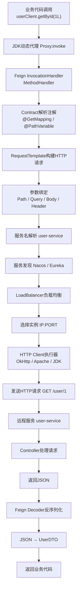

+++
date = '2026-06-23T13:20:18+08:00'
draft = true
title = 'Spring Cloud 面试题整理'
categories = ["编程"]
tags = ["面试题"]
[cover]
  image = ""
+++

## OpenFeign 服务调用过程

```mermaid
flowchart TD

A["业务代码调用<br/>userClient.getById(1L)"] --> B["JDK动态代理 Proxy.invoke"]

B --> C["Feign InvocationHandler<br/>MethodHandler"]

C --> D["Contract解析注解<br/>@GetMapping / @PathVariable"]

D --> E["RequestTemplate构建HTTP请求"]

E --> F["参数绑定<br/>Path / Query / Body / Header"]

F --> G["服务名解析 user-service"]

G --> H["服务发现 Nacos / Eureka"]

H --> I["LoadBalancer负载均衡"]

I --> J["选择实例 IP:PORT"]

J --> K["HTTP Client执行器<br/>OkHttp / Apache / JDK"]

K --> L["发送HTTP请求 GET /user/1"]

L --> M["远程服务 user-service"]

M --> N["Controller处理请求"]

N --> O["返回JSON"]

O --> P["Feign Decoder反序列化"]

P --> Q["JSON → UserDTO"]

Q --> R["返回业务代码"]
```