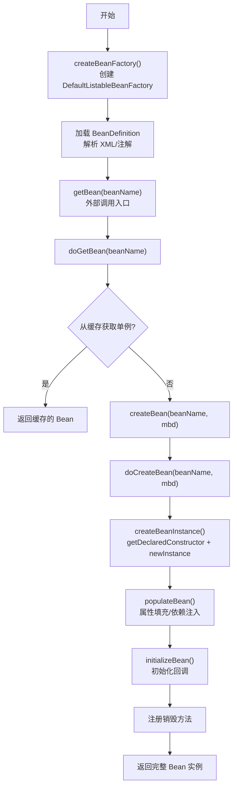
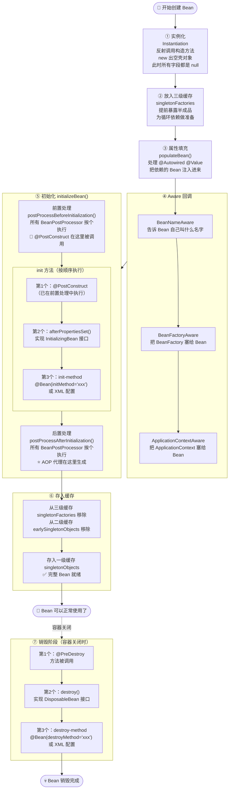
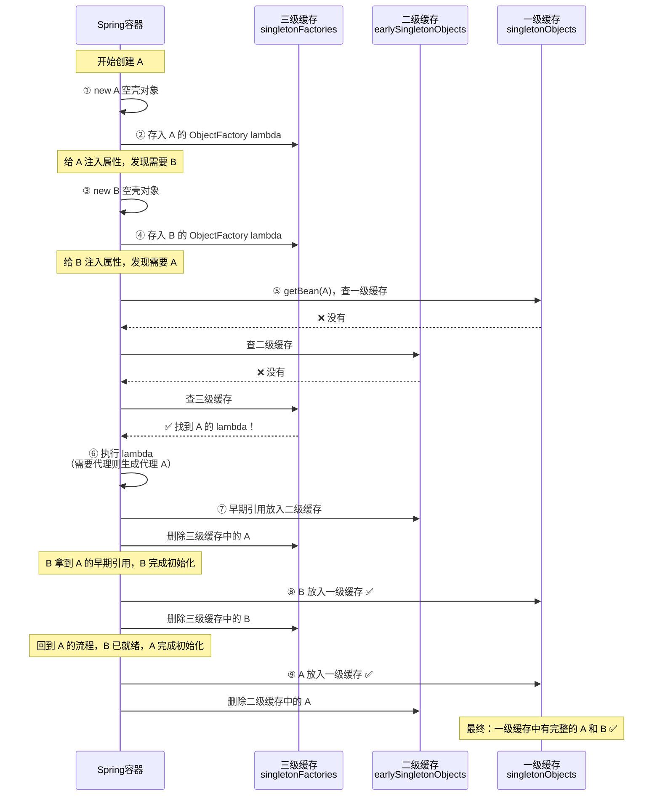
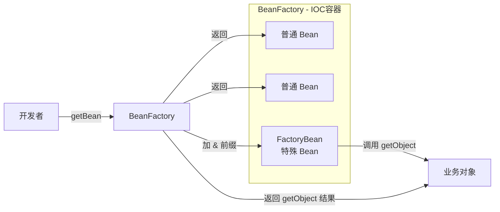
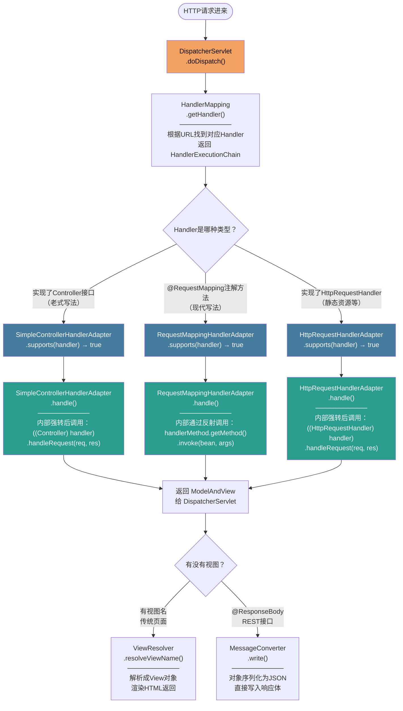
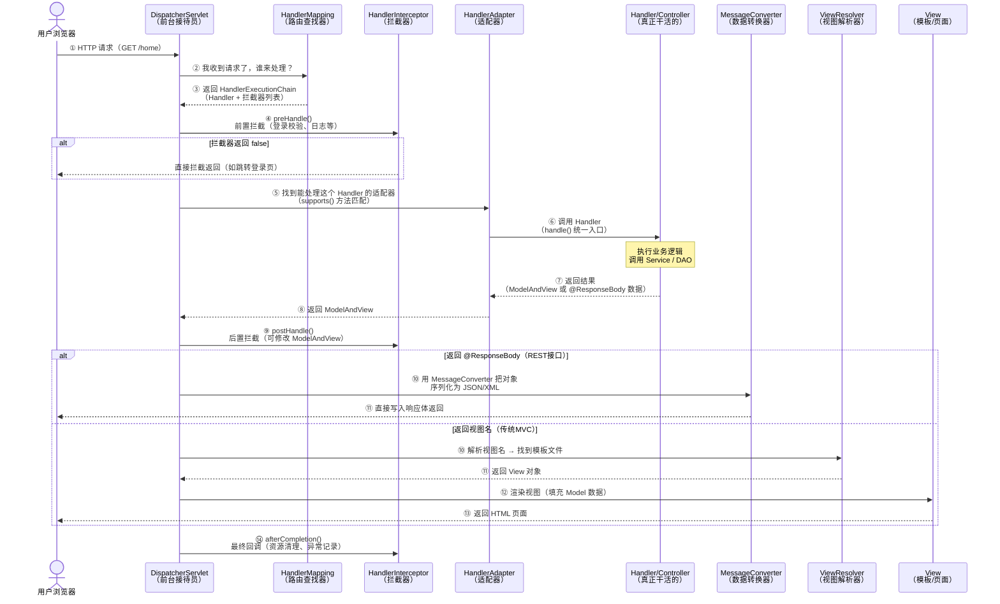
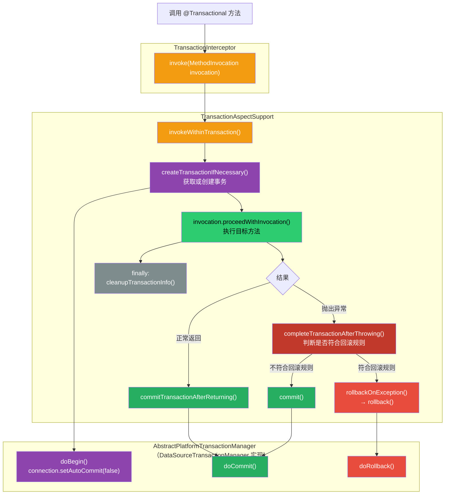

+++
date = '2026-06-19T23:19:24+08:00'
draft = true
title = 'Spring 面试题整理'
categories = ["编程"]
tags = ["面试题"]
+++

> 面试题从互联网各个角落收集而来

## 谈一谈 Spring IOC 的底层实现？

- 反射
- 工厂的价值
- 设计模式
- 关键的几个方法
  - createBeanFactory
  - getBean
  - doGetBean
  - createBean
  - doCreateBean
  - createBeanInstance(getDeclaredConstructor, newInstance)
  - populateBean


## 谈谈 SpringIOC 的理解，原理和实现？

- IOC 思想
- DI 实现手段
- 什么是容器 什么是Bean
- BeanDefination
  - 从哪里读
    - XML
    - 注解
  - 存哪里
    - 所有 BeanDefinition 都存在 DefaultListableBeanFactory 里的一个 Map 中


## 容器的生命周期

```mermaid
flowchart TD
    START([🚀 程序启动]) --> REFRESH["AbstractApplicationContext.refresh()"]

    REFRESH --> PHASE1

    subgraph PHASE1["🔵 第一阶段：准备工作"]
        direction TB
        A1["prepareRefresh()\n记录启动时间\n设置容器状态为「活跃」\n初始化环境变量"] --> A2
        A2["obtainFreshBeanFactory()\n创建 DefaultListableBeanFactory\n这是容器的核心仓库"] --> A3
        A3["prepareBeanFactory()\n注册基础 BeanPostProcessor\n注册 Aware 相关处理器\n注册默认环境 Bean（environment）"]
    end

    PHASE1 --> PHASE2

    subgraph PHASE2["🟢 第二阶段：加载 BeanDefinition（读图纸）"]
        direction TB
        B1["扫描 @ComponentScan 指定的包\n或读取 XML 配置文件"] --> B2
        B2["解析注解 / XML\n识别 @Component @Service\n@Repository @Controller @Bean"] --> B3
        B3["为每个 Bean 生成 BeanDefinition\n记录：类名、作用域、是否懒加载\n初始化方法、销毁方法、依赖关系"] --> B4
        B4[("存入 beanDefinitionMap\nkey = beanName\nvalue = BeanDefinition")]
    end

    PHASE2 --> PHASE3

    subgraph PHASE3["🟡 第三阶段：修改 BeanDefinition（修图纸）"]
        direction TB
        C1["invokeBeanFactoryPostProcessors()\n执行所有 BeanFactoryPostProcessor"] --> C2
        C2["ConfigurationClassPostProcessor\n处理 @Configuration @Import\n@PropertySource @ComponentScan\n👉 SpringBoot 自动装配在此触发"] --> C3
        C3["PropertySourcesPlaceholderConfigurer\n替换 BeanDefinition 中\n所有 ${xxx} 占位符为真实值"] --> C4
        C4[/"所有 BeanDefinition 最终确定\n图纸不再变动"/]
    end

    PHASE3 --> PHASE4

    subgraph PHASE4["🌸 第四阶段：注册 BeanPostProcessor（工人就位）"]
        direction TB
        D1["registerBeanPostProcessors()\n按优先级顺序注册\nPriorityOrdered → Ordered → 普通"] --> D2
        D2["AutowiredAnnotationBeanPostProcessor\n负责处理 @Autowired @Value"] --> D3
        D3["CommonAnnotationBeanPostProcessor\n负责处理 @PostConstruct @PreDestroy @Resource"] --> D4
        D4["AnnotationAwareAspectJAutoProxyCreator\n负责检测切面、生成 AOP 代理对象"] --> D5
        D5[/"所有工人就位\n等待 Bean 创建时介入\n此时不开工"/]
    end

    PHASE4 --> PHASE5

    subgraph PHASE5["🟣 第五阶段：容器基础设施初始化"]
        direction TB
        E1["initMessageSource()\n初始化国际化资源 i18n"] --> E2
        E2["initApplicationEventMulticaster()\n初始化事件广播器"] --> E3
        E3["onRefresh()\n⭐ SpringBoot 在此启动\nTomcat / Jetty / Undertow\nWeb 容器开始监听端口"] --> E4
        E4["registerListeners()\n注册所有 ApplicationListener\n监听容器事件"]
    end

    PHASE5 --> PHASE6

    subgraph PHASE6["🟠 第六阶段：实例化所有单例 Bean"]
        direction TB
        F1["finishBeanFactoryInitialization()\npreInstantiateSingletons()\n遍历所有非懒加载单例 BeanDefinition"] --> F2
        F2["逐个执行 getBean()\n触发每个 Bean 的生命周期\n实例化 → 属性填充 → Aware回调\n→ 前置处理 → init方法 → 后置处理"] --> F3
        F3[("所有单例 Bean 存入\nsingletonObjects 一级缓存\n✅ 全部就绪")]
    end

    PHASE6 --> PHASE7

    subgraph PHASE7["✅ 第七阶段：容器就绪"]
        direction TB
        G1["finishRefresh()\n清理启动时占用的资源\n初始化生命周期处理器"] --> G2
        G2["发布 ContextRefreshedEvent\n通知所有监听者：容器启动完成"] --> G3
        G3[/"容器进入运行状态\n可以处理业务请求"/]
    end

    G3 --> RUNNING([🎉 容器正常运行中])

    RUNNING -.->|"收到关闭信号\nCtrl+C / kill / close()"| PHASE8

    subgraph PHASE8["🔴 第八阶段：容器销毁"]
        direction TB
        H1["发布 ContextClosedEvent\n通知所有监听者：容器即将关闭"] --> H2
        H2["停止 Web 容器\nTomcat 停止接受新请求"] --> H3
        H3["执行所有 Bean 的销毁逻辑\n@PreDestroy → destroy() → destroy-method\n按注册顺序逆序销毁"] --> H4
        H4["清空所有缓存\nsingletonObjects 清空\nbeanDefinitionMap 清空"] --> H5
        H5["容器状态设置为「关闭」\nactive = false / closed = true"]
    end

    H5 --> END([💀 容器销毁完成])

    style START fill:#43A047,color:#fff
    style RUNNING fill:#43A047,color:#fff
    style END fill:#e53935,color:#fff
    style REFRESH fill:#1E88E5,color:#fff
```



## bean 的生命周期



## spring 三级缓存依赖流程


| 情况               | 三级缓存    | lambda 执行 | 二级缓存   |
| ------------------ | ----------- | ----------- | ---------- |
| 无循环依赖，无 AOP | 存了 lambda | ❌ 不执行    | 不经过     |
| 无循环依赖，有 AOP | 存了 lambda | ❌ 不执行    | 不经过     |
| 有循环依赖，无 AOP | 存了 lambda | ✅ 执行      | 存原始对象 |
| 有循环依赖，有 AOP | 存了 lambda | ✅ 执行      | 存代理对象 |

## spring bean 缓存的放置时间和删除时间

## Spring Bean 三级缓存的放置与删除时间

| 缓存                         | 存的是什么            | 放入时机             | 删除时机                                 |
| ---------------------------- | --------------------- | -------------------- | ---------------------------------------- |
| 三级 `singletonFactories`    | Bean 的工厂 lambda    | 实例化完成后立刻放入 | 工厂被调用时（升级到二级）或 Bean 完成时 |
| 二级 `earlySingletonObjects` | 早期暴露的半成品 Bean | 三级工厂被调用的瞬间 | Bean 完全初始化完成放入一级时            |
| 一级 `singletonObjects`      | 完整可用的 Bean       | 初始化全部完成后     | 容器关闭销毁时                           |

## BeanFactory 和 FactoryBean 的区别？

### FactoryBean 是什么

```java
public interface FactoryBean<T> {
    // 返回 Bean 的实例（可以是复杂创建逻辑）
    T getObject() throws Exception;
    
    // 返回 Bean 的类型
    Class<?> getObjectType();
    
    // 是否单例
    default boolean isSingleton() {
        return true;
    }
}
```

- 相同点
  - 都是用来创建Bean对象的
- 不同点
  - 使用 BeanFactory 创建对象的适合必须遵循严格的生命周期流程，太复杂了。如果想简单自定义某个对象的创建，同时想交给spring管理，那么必须实现 FactoryBean 接口
    - isSingleton 是否是单例对象
    - getObjectType 获取返回对象的类型
    - getObject 自定义创建对象的过程

| 对比维度     | BeanFactory                            | FactoryBean                                 |
| ------------ | -------------------------------------- | ------------------------------------------- |
| **角色**     | 容器/工厂接口                          | 特殊的 Bean                                 |
| **功能**     | 管理所有 Bean 的生命周期               | 自定义某个 Bean 的创建逻辑                  |
| **定位**     | 基础设施（IOC 容器）                   | 业务扩展（创建复杂对象）                    |
| **使用方式** | 由 Spring 框架实现和使用               | 由开发者实现，注册到容器中                  |
| **常见实现** | `DefaultListableBeanFactory`           | `SqlSessionFactoryBean`、`ProxyFactoryBean` |
| **谁创建谁** | `BeanFactory` 创建并管理 `FactoryBean` | `FactoryBean` 创建业务对象                  |

---



## Spring中用到的设计模式
- 单例模式
- 原型模式（指定作用域为prototype）
- 工厂模式
  - BeanFactory
- 模板方法
  - JdbcTemplate
  - TransactionTemplate
  - RestTemplate
  - RedisTemplate
- 策略模式
  - XmlBeanDefinitionReader
  - PropertiesBeanDefinitionReader
- 观察者模式
  - listener
  - event
  - multicast
- 适配器模式
  - HandlerAdapter
- 装饰者模式
  - BeanWrapper
- 责任链模式
  - 使用aop的时候会先生成一个拦截器链
  - SpringMVC 的filter责任链
- 代理模式
  - 动态代理
- 委托者模式
  - delegate


## Spring AOP 底层实现原理

### 🥇 第一层：一句话定性（开场）

> "Spring AOP 的底层本质是**动态代理**。Spring 在容器初始化 Bean 的时候，通过 `BeanPostProcessor` 机制拦截，判断这个 Bean 是否需要被增强，如果需要，就用动态代理生成一个代理对象，替换掉原始 Bean 注册进容器。后续所有对这个 Bean 的调用，实际上都是在走代理对象。"

---

### 🥈 第二层：展开两种代理方式（核心）

> "具体的代理方式有两种——"
>
> "第一种是 **JDK 动态代理**，基于接口实现，用 `Proxy.newProxyInstance` 生成代理，目标类必须有接口。"
>
> "第二种是 **CGLIB 动态代理**，基于字节码在运行时生成目标类的子类，不需要接口，但目标类和方法不能是 `final`。"
>
> "Spring Boot 2.x 之后，默认强制走 CGLIB，除非手动配置 `proxyTargetClass = false`。"

---

### 🥉 第三层：说清楚调用链路（亮点）

> "调用链路上，Spring 用 `ReflectiveMethodInvocation` 把所有匹配的 `Advice` 组装成一个**拦截器链**，通过递归 `proceed()` 依次执行。执行顺序是：`@Around` 前半段 → `@Before` → 目标方法 → `@AfterReturning` / `@AfterThrowing` → `@After`（finally）→ `@Around` 后半段。"

---

### 💡 主动抛出一个坑，拉开差距

> "这里有个常见的坑——**同类内自调用会导致 AOP 失效**。比如方法 A 内部用 `this.B()` 调用同类方法 B，走的是原始对象，绕过了代理，`@Transactional` 这种注解就不生效了。解决方案是注入自身的代理对象，或者用 `AopContext.currentProxy()` 拿到当前代理。"

---

### 追问预案

| 面试官追问                             | 你的应对方向                                                                                                               |
| -------------------------------------- | -------------------------------------------------------------------------------------------------------------------------- |
| JDK 和 CGLIB 性能差异？                | JDK 反射调用早期慢，JDK 8+ 有优化；CGLIB 创建慢但调用快；现代版本差距不大                                                  |
| Spring AOP 和 AspectJ 有什么区别？     | Spring AOP 运行时代理，只能拦截 Spring 管理的 Bean 的方法；AspectJ 编译期/加载期织入字节码，功能更强（可拦截构造器、字段） |
| `@Transactional` 为什么基于 AOP？      | 它本质是一个 `Around Advice`，在方法前开启事务，正常结束提交，异常回滚                                                     |
| `BeanPostProcessor` 是什么时候触发的？ | Bean 初始化完成后（`initializeBean` 最后阶段），`postProcessAfterInitialization` 被调用                                    |
| 为什么 `final` 方法不能被 CGLIB 代理？ | CGLIB 是通过继承生成子类来覆盖方法，`final` 方法无法被子类覆盖，因此拦截不到                                               |

---

### ❌ 常见回答误区

```
❌ "Spring AOP 就是用了反射"
   → 太浅，反射只是 JDK 代理调用目标方法的手段

❌ "CGLIB 比 JDK 代理快，所以 Spring 默认用 CGLIB"
   → 逻辑倒置，Spring Boot 2.x 改默认的原因主要是为了
     避免「接口代理注入实现类」时的类型转换问题，不是纯性能考量

❌ 把 AspectJ 的编译期织入当成 Spring AOP 的原理来说
   → 混淆了两套体系，Spring AOP 默认不用 AspectJ 的织入器
```

## SpringMVC 适配器请求处理流程



## SpringMVC 请求处理完整流程



## Spring 的事务是如何回滚的

### 🥇 第一层：一句话定性（开场）

> "Spring 的事务回滚，底层是基于 AOP 实现的。`@Transactional` 本质上是一个 `Around Advice`，Spring 在方法执行前开启事务，方法正常返回则提交，如果捕获到异常则触发回滚。具体的事务操作委托给 `PlatformTransactionManager` 来执行，和底层数据库交互。"

---

### 🥈 第二层：说清楚完整流程（核心）

> "具体流程是这样的——"



> "判断是否回滚，Spring 默认只对 **`RuntimeException` 和 `Error`** 回滚，受检异常（`checked Exception`）默认**不回滚**。"

---

### 🥉 第三层：说清楚回滚规则配置（细节）

> "回滚规则可以手动配置——"

```java
// 指定某个受检异常也要回滚
@Transactional(rollbackFor = Exception.class)

// 指定某个异常不回滚
@Transactional(noRollbackFor = IllegalArgumentException.class)
```

> "Spring 内部用 `RollbackRuleAttribute` 来匹配异常类型，遍历异常继承链，找到最近的匹配规则来决定是提交还是回滚。"

---

### 💡 主动抛出经典坑点，拉开差距

**坑一：自调用导致事务失效（和 AOP 同根同源）**

> "同类内部方法互调，`@Transactional` 不生效，原因和 AOP 自调用失效一样——绕过了代理对象。"

```java
@Service
public class OrderService {
    public void placeOrder() {
        this.pay(); // ❌ 事务不生效，走的是原始对象
    }

    @Transactional
    public void pay() { ... }
}
```

**坑二：异常被吃掉，事务无法感知**

> "如果在方法内部把异常 `try-catch` 吃掉了，`TransactionInterceptor` 捕获不到异常，就不会触发回滚。"

```java
@Transactional
public void pay() {
    try {
        db.update(...);
    } catch (Exception e) {
        log.error("error", e); // ❌ 异常被吃，事务照常提交
    }
}
```

> "解决方法：catch 后手动标记回滚——"

```java
catch (Exception e) {
    TransactionAspectSupport.currentTransactionStatus()
        .setRollbackOnly(); // ✅ 手动触发回滚
}
```

**坑三：受检异常默认不回滚**

```java
@Transactional
public void pay() throws IOException {
    throw new IOException("文件不存在"); // ❌ 默认不回滚！
}

// 正确做法：
@Transactional(rollbackFor = Exception.class) // ✅
```

---

### 追问预案

| 面试官追问                           | 应对方向                                                                                                                        |
| ------------------------------------ | ------------------------------------------------------------------------------------------------------------------------------- |
| 事务传播机制说一下？                 | `REQUIRED`（默认，加入或新建）/ `REQUIRES_NEW`（挂起外层，新建）/ `NESTED`（嵌套，savepoint）等 7 种，重点说前三                |
| `REQUIRES_NEW` 和 `NESTED` 的区别？  | `REQUIRES_NEW` 是完全独立的新事务，外层回滚不影响它；`NESTED` 是嵌套在外层事务里，外层回滚会带着它一起滚                        |
| Spring 事务和数据库事务的关系？      | Spring 事务是对数据库连接 `connection` 的封装管理，最终还是靠数据库的 ACID 保证，Spring 只是控制了 `commit` / `rollback` 的时机 |
| 多线程下 `@Transactional` 还有效吗？ | 无效。Spring 事务通过 `ThreadLocal` 绑定当前线程的 connection，子线程拿不到同一个 connection，事务无法传播                      |
| `@Transactional` 加在接口上有效吗？  | 不推荐。JDK 代理下勉强可以，CGLIB 代理下完全无效，Spring 官方建议始终加在实现类上                                               |

---

### ❌ 常见回答误区

```
❌ "Spring 事务就是加了个注解，自动提交和回滚"
   → 没说出 AOP 代理、TransactionInterceptor、连接管理这些核心机制

❌ "所有异常都会回滚"
   → 经典错误，默认只回滚 RuntimeException 和 Error

❌ "事务传播只知道 REQUIRED"
   → 至少要能说出 REQUIRES_NEW 和 NESTED 及其区别
```

## 说一说 Spring 的事务传播


### 一、 核心必会（最常用，决定生死存亡）

* **`REQUIRED` (默认行为)**
* **一句话概括**：**同生共死。**
* **逻辑**：如果外层有事务，就加入它；如果没有，就自己新建一个。只要其中一个报错，全盘回滚。


* **`REQUIRES_NEW`**
* **一句话概括**：**各过各的。**
* **逻辑**：不管外层有没有事务，都必须挂起外层，自己开启一个全新的独立事务。两者互不干扰，适合做日志记录。


* **`NESTED`**
* **一句话概括**：**长幼有序。**
* **逻辑**：在外层事务中建立一个“保存点（Savepoint）”。子事务失败了可以单独回滚，不影响外层；但外层如果回滚，子事务必须跟着一起回滚。


---

### 二、 温和顺从（顺应外层环境）

* **`SUPPORTS`**
* **一句话概括**：**随缘吃席。**
* **逻辑**：外层有事务，我就加入事务运行；外层没有事务，我就以非事务（普通方法）方式运行。


* **`NOT_SUPPORTED`**
* **一句话概括**：**拒绝被卷。**
* **逻辑**：不支持事务。如果外层有事务，先把外层事务挂起/暂停，自己以非事务方式运行完了，再让外层事务继续。


---

### 三、 强硬排他（极端的规则破坏者）

* **`MANDATORY`**
* **一句话概括**：**没票别进。**
* **逻辑**：强制要求外层必须有事务，如果没有，直接抛出异常（`IllegalTransactionStateException`）。


* **`NEVER`**
* **一句话概括**：**绝不沾毒。**
* **逻辑**：坚决不支持事务。如果外层有事务，直接抛出异常；只有外层没有事务时，它才愿意正常运行。

