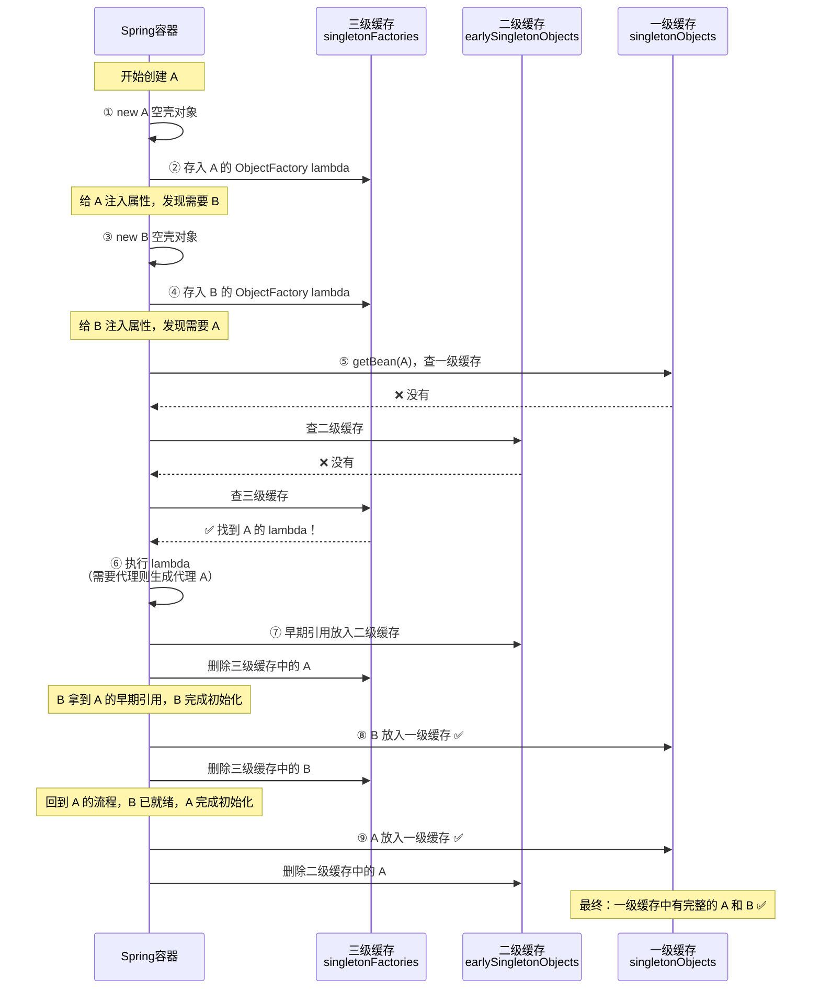

+++
date = '2026-06-19T23:19:24+08:00'
draft = true
title = 'Java后端 面试题整理'
categories = ["编程"]
tags = [""]
+++

# Spring

## 谈谈 SpringIOC 的理解，原理和实现？

## spring 三级缓存依赖流程

| 情况 | 三级缓存 | lambda 执行 | 二级缓存 |
|------|---------|------------|---------|
| 无循环依赖，无 AOP | 存了 lambda | ❌ 不执行 | 不经过 |
| 无循环依赖，有 AOP | 存了 lambda | ❌ 不执行 | 不经过 |
| 有循环依赖，无 AOP | 存了 lambda | ✅ 执行 | 存原始对象 |
| 有循环依赖，有 AOP | 存了 lambda | ✅ 执行 | 存代理对象 |
