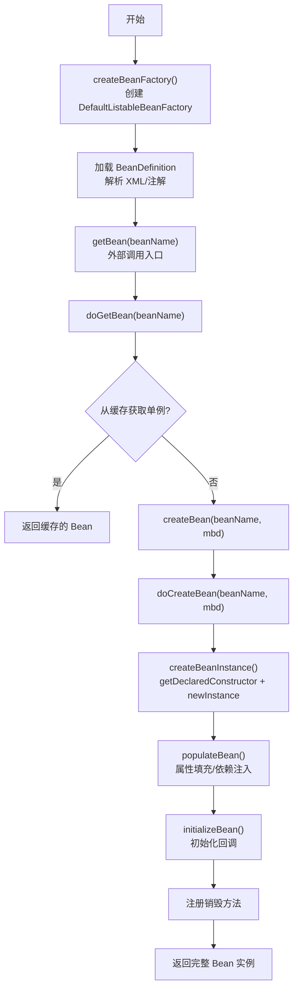
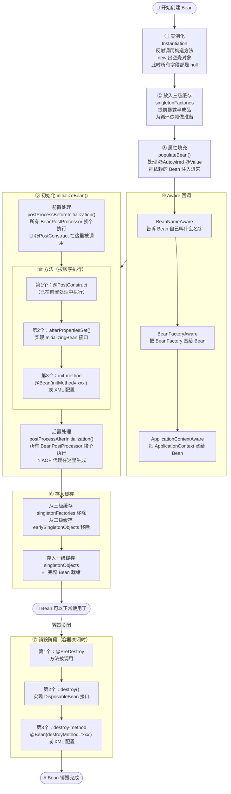
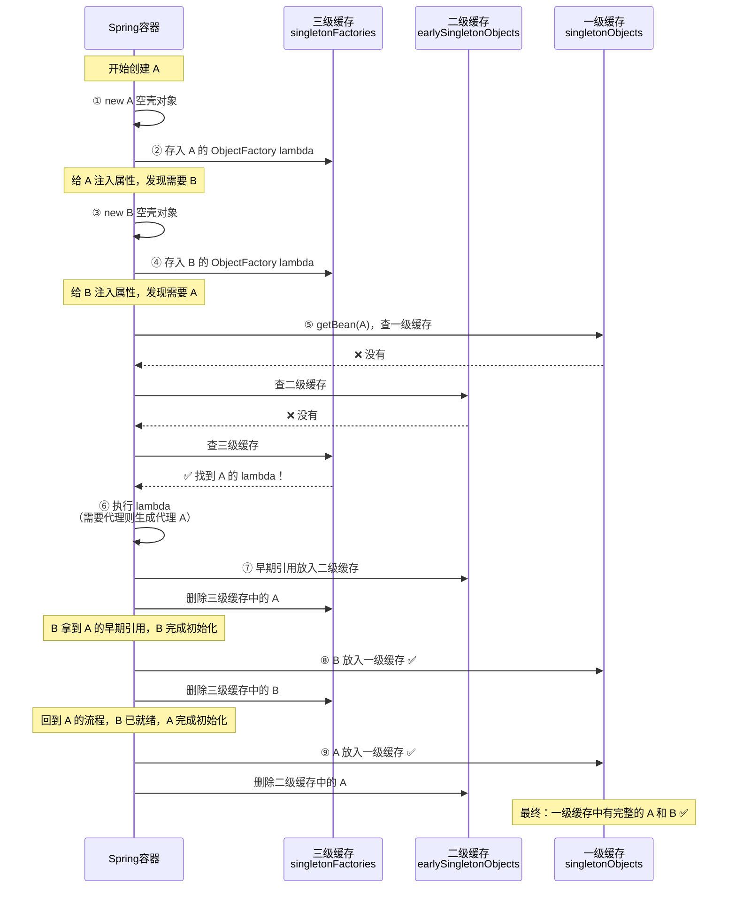
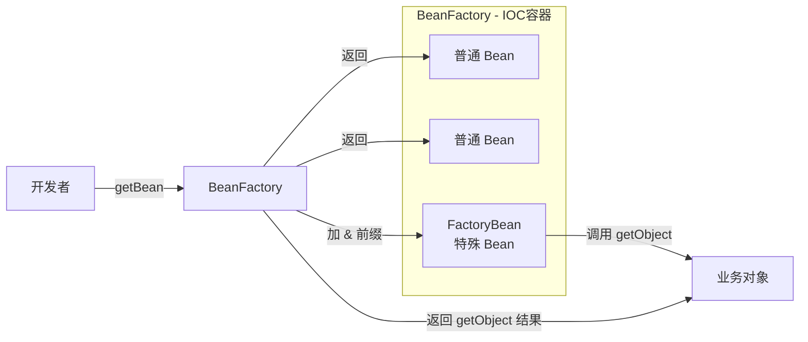
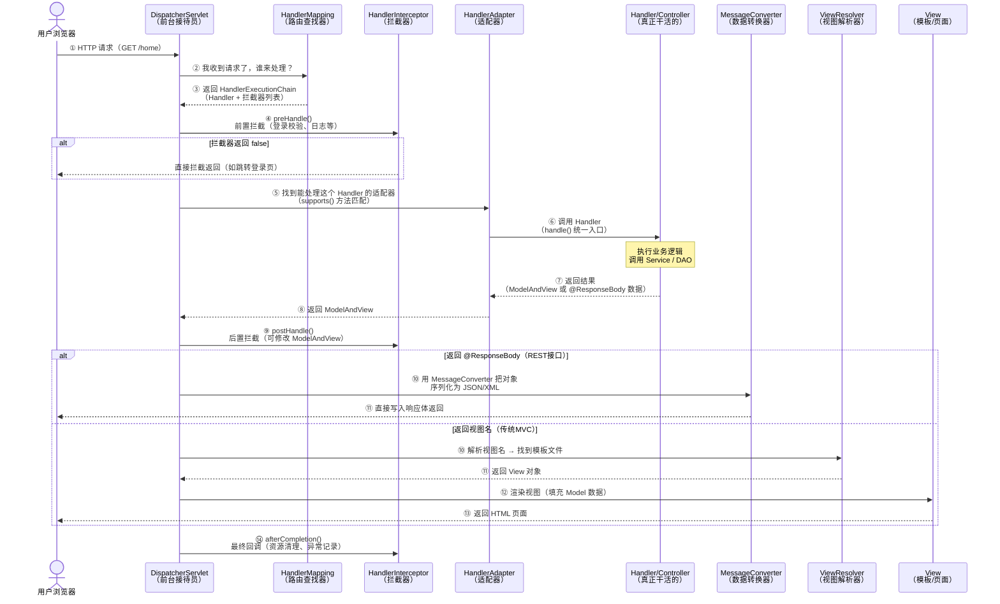

+++
date = '2026-06-19T23:19:24+08:00'
draft = true
title = 'Spring 面试题整理'
categories = ["编程"]
tags = [""]
+++

> 面试题从互联网各个角落收集而来

# Spring

## 谈一谈 Spring IOC 的底层实现？

- 反射
- 工厂的价值
- 设计模式
- 关键的几个方法
  - createBeanFactory
  - getBean
  - doGetBean
  - createBean
  - doCreateBean
  - createBeanInstance(getDeclaredConstructor, newInstance)
  - populateBean


## 谈谈 SpringIOC 的理解，原理和实现？

- IOC 思想
- DI 实现手段
- 什么是容器 什么是Bean
- BeanDefination
  - 从哪里读
    - XML
    - 注解
  - 存哪里
    - 所有 BeanDefinition 都存在 DefaultListableBeanFactory 里的一个 Map 中


## 容器的生命周期

```mermaid
flowchart TD
    START([🚀 程序启动]) --> REFRESH["AbstractApplicationContext.refresh()"]

    REFRESH --> PHASE1

    subgraph PHASE1["🔵 第一阶段：准备工作"]
        direction TB
        A1["prepareRefresh()\n记录启动时间\n设置容器状态为「活跃」\n初始化环境变量"] --> A2
        A2["obtainFreshBeanFactory()\n创建 DefaultListableBeanFactory\n这是容器的核心仓库"] --> A3
        A3["prepareBeanFactory()\n注册基础 BeanPostProcessor\n注册 Aware 相关处理器\n注册默认环境 Bean（environment）"]
    end

    PHASE1 --> PHASE2

    subgraph PHASE2["🟢 第二阶段：加载 BeanDefinition（读图纸）"]
        direction TB
        B1["扫描 @ComponentScan 指定的包\n或读取 XML 配置文件"] --> B2
        B2["解析注解 / XML\n识别 @Component @Service\n@Repository @Controller @Bean"] --> B3
        B3["为每个 Bean 生成 BeanDefinition\n记录：类名、作用域、是否懒加载\n初始化方法、销毁方法、依赖关系"] --> B4
        B4[("存入 beanDefinitionMap\nkey = beanName\nvalue = BeanDefinition")]
    end

    PHASE2 --> PHASE3

    subgraph PHASE3["🟡 第三阶段：修改 BeanDefinition（修图纸）"]
        direction TB
        C1["invokeBeanFactoryPostProcessors()\n执行所有 BeanFactoryPostProcessor"] --> C2
        C2["ConfigurationClassPostProcessor\n处理 @Configuration @Import\n@PropertySource @ComponentScan\n👉 SpringBoot 自动装配在此触发"] --> C3
        C3["PropertySourcesPlaceholderConfigurer\n替换 BeanDefinition 中\n所有 ${xxx} 占位符为真实值"] --> C4
        C4[/"所有 BeanDefinition 最终确定\n图纸不再变动"/]
    end

    PHASE3 --> PHASE4

    subgraph PHASE4["🌸 第四阶段：注册 BeanPostProcessor（工人就位）"]
        direction TB
        D1["registerBeanPostProcessors()\n按优先级顺序注册\nPriorityOrdered → Ordered → 普通"] --> D2
        D2["AutowiredAnnotationBeanPostProcessor\n负责处理 @Autowired @Value"] --> D3
        D3["CommonAnnotationBeanPostProcessor\n负责处理 @PostConstruct @PreDestroy @Resource"] --> D4
        D4["AnnotationAwareAspectJAutoProxyCreator\n负责检测切面、生成 AOP 代理对象"] --> D5
        D5[/"所有工人就位\n等待 Bean 创建时介入\n此时不开工"/]
    end

    PHASE4 --> PHASE5

    subgraph PHASE5["🟣 第五阶段：容器基础设施初始化"]
        direction TB
        E1["initMessageSource()\n初始化国际化资源 i18n"] --> E2
        E2["initApplicationEventMulticaster()\n初始化事件广播器"] --> E3
        E3["onRefresh()\n⭐ SpringBoot 在此启动\nTomcat / Jetty / Undertow\nWeb 容器开始监听端口"] --> E4
        E4["registerListeners()\n注册所有 ApplicationListener\n监听容器事件"]
    end

    PHASE5 --> PHASE6

    subgraph PHASE6["🟠 第六阶段：实例化所有单例 Bean"]
        direction TB
        F1["finishBeanFactoryInitialization()\npreInstantiateSingletons()\n遍历所有非懒加载单例 BeanDefinition"] --> F2
        F2["逐个执行 getBean()\n触发每个 Bean 的生命周期\n实例化 → 属性填充 → Aware回调\n→ 前置处理 → init方法 → 后置处理"] --> F3
        F3[("所有单例 Bean 存入\nsingletonObjects 一级缓存\n✅ 全部就绪")]
    end

    PHASE6 --> PHASE7

    subgraph PHASE7["✅ 第七阶段：容器就绪"]
        direction TB
        G1["finishRefresh()\n清理启动时占用的资源\n初始化生命周期处理器"] --> G2
        G2["发布 ContextRefreshedEvent\n通知所有监听者：容器启动完成"] --> G3
        G3[/"容器进入运行状态\n可以处理业务请求"/]
    end

    G3 --> RUNNING([🎉 容器正常运行中])

    RUNNING -.->|"收到关闭信号\nCtrl+C / kill / close()"| PHASE8

    subgraph PHASE8["🔴 第八阶段：容器销毁"]
        direction TB
        H1["发布 ContextClosedEvent\n通知所有监听者：容器即将关闭"] --> H2
        H2["停止 Web 容器\nTomcat 停止接受新请求"] --> H3
        H3["执行所有 Bean 的销毁逻辑\n@PreDestroy → destroy() → destroy-method\n按注册顺序逆序销毁"] --> H4
        H4["清空所有缓存\nsingletonObjects 清空\nbeanDefinitionMap 清空"] --> H5
        H5["容器状态设置为「关闭」\nactive = false / closed = true"]
    end

    H5 --> END([💀 容器销毁完成])

    style START fill:#43A047,color:#fff
    style RUNNING fill:#43A047,color:#fff
    style END fill:#e53935,color:#fff
    style REFRESH fill:#1E88E5,color:#fff
```



## bean 的生命周期



## spring 三级缓存依赖流程


| 情况               | 三级缓存    | lambda 执行 | 二级缓存   |
| ------------------ | ----------- | ----------- | ---------- |
| 无循环依赖，无 AOP | 存了 lambda | ❌ 不执行    | 不经过     |
| 无循环依赖，有 AOP | 存了 lambda | ❌ 不执行    | 不经过     |
| 有循环依赖，无 AOP | 存了 lambda | ✅ 执行      | 存原始对象 |
| 有循环依赖，有 AOP | 存了 lambda | ✅ 执行      | 存代理对象 |

## spring bean 缓存的放置时间和删除时间

## Spring Bean 三级缓存的放置与删除时间

| 缓存                         | 存的是什么            | 放入时机             | 删除时机                                 |
| ---------------------------- | --------------------- | -------------------- | ---------------------------------------- |
| 三级 `singletonFactories`    | Bean 的工厂 lambda    | 实例化完成后立刻放入 | 工厂被调用时（升级到二级）或 Bean 完成时 |
| 二级 `earlySingletonObjects` | 早期暴露的半成品 Bean | 三级工厂被调用的瞬间 | Bean 完全初始化完成放入一级时            |
| 一级 `singletonObjects`      | 完整可用的 Bean       | 初始化全部完成后     | 容器关闭销毁时                           |

## BeanFactory 和 FactoryBean 的区别？


### FactoryBean 是什么

```java
public interface FactoryBean<T> {
    // 返回 Bean 的实例（可以是复杂创建逻辑）
    T getObject() throws Exception;
    
    // 返回 Bean 的类型
    Class<?> getObjectType();
    
    // 是否单例
    default boolean isSingleton() {
        return true;
    }
}
```

- 相同点
  - 都是用来创建Bean对象的
- 不同点
  - 使用 BeanFactory 创建对象的适合必须遵循严格的生命周期流程，太复杂了。如果想简单自定义某个对象的创建，同时想交给spring管理，那么必须实现 FactoryBean 接口
    - isSingleton 是否是单例对象
    - getObjectType 获取返回对象的类型
    - getObject 自定义创建对象的过程

| 对比维度     | BeanFactory                            | FactoryBean                                 |
| ------------ | -------------------------------------- | ------------------------------------------- |
| **角色**     | 容器/工厂接口                          | 特殊的 Bean                                 |
| **功能**     | 管理所有 Bean 的生命周期               | 自定义某个 Bean 的创建逻辑                  |
| **定位**     | 基础设施（IOC 容器）                   | 业务扩展（创建复杂对象）                    |
| **使用方式** | 由 Spring 框架实现和使用               | 由开发者实现，注册到容器中                  |
| **常见实现** | `DefaultListableBeanFactory`           | `SqlSessionFactoryBean`、`ProxyFactoryBean` |
| **谁创建谁** | `BeanFactory` 创建并管理 `FactoryBean` | `FactoryBean` 创建业务对象                  |

---



### Spring中用到的设计模式
- 单例模式
- 原型模式（指定作用域为prototype）
- 工厂模式
  - BeanFactory
- 模板方法
  - JdbcTemplate
  - TransactionTemplate
  - RestTemplate
  - RedisTemplate
- 策略模式
  - XmlBeanDefinitionReader
  - PropertiesBeanDefinitionReader
- 观察者模式
  - listener
  - event
  - multicast
- 适配器模式
  - HandlerAdapter
- 装饰者模式
  - BeanWrapper
- 责任链模式
  - 使用aop的时候会先生成一个拦截器链
- 代理模式
  - 动态代理
- 委托者模式
  - delegate

## SpringMVC 请求处理完整流程

