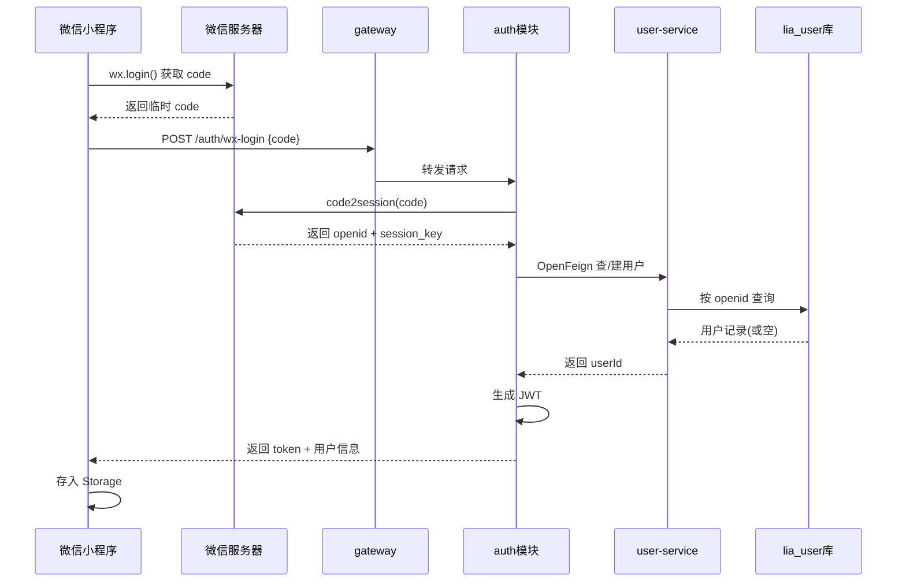

+++
date = '2026-06-23T14:02:30+08:00'
draft = true
title = '微信小程序开发受苦指南'
categories = ["编程"]
tags = ["微信小程序开发","前端开发"]
[cover]
  image = ""
+++

##  微信小程序和后端用户认证交互流程

微信小程序登录的核心流程：小程序拿临时凭证 `code` → 后端用 `code` 换 `openid` → 后端发自己的 JWT 给小程序。下面是整体流程图。



### 关键点拆解

**1. 小程序端拿 code（前端）**

```javascript
wx.login({
  success(res) {
    // res.code 是一次性临时凭证，5分钟过期
    wx.request({
      url: 'https://你的域名/auth/wx-login',
      method: 'POST',
      data: { code: res.code }
    })
  }
})
```

**2. 后端用 code 换 openid**

请求微信接口 `https://api.weixin.qq.com/sns/jscode2session`，带四个参数：

| 参数       | 值                                     |
| ---------- | -------------------------------------- |
| appid      | 小程序 AppID                           |
| secret     | 小程序 AppSecret（配在 Nacos，别写死） |
| js_code    | 前端传来的 code                        |
| grant_type | 固定填 `authorization_code`            |

微信返回 `openid`（用户唯一标识）和 `session_key`（解密用，登录场景可暂时不用）。

**3. openid 是身份，不是密码**

`openid` 只是"这个用户是谁"的标识。你不能信任前端直接传 openid，必须每次都用 code 去微信换，这样才防伪造。

**4. 在你的架构里怎么放**

放 `auth` 模块最合适，和你已有的 JWT 登录逻辑并列：

- `auth` 模块新增 `WxLoginController` + `WxLoginService`
- 调微信接口用 `RestClient`/`WebClient`（你已在用 Spring Boot 3）
- 拿到 openid 后，通过 **OpenFeign** 调 `user-service` 做"查不到就注册"（upsert）
- `lia_user` 表加一列 `openid`（唯一索引）
- 复用你现有的 JWT 工具类签发 token

**5. 数据库改动**

```sql
ALTER TABLE tb_user ADD COLUMN openid VARCHAR(64) UNIQUE;
```

整个流程和你现在的账号密码登录共用同一套 JWT 体系，只是"验证身份"那一步从"校验密码"换成了"用 code 换 openid"。

需要我帮你写 `auth` 模块那段调微信接口 + 签发 JWT 的完整代码吗？